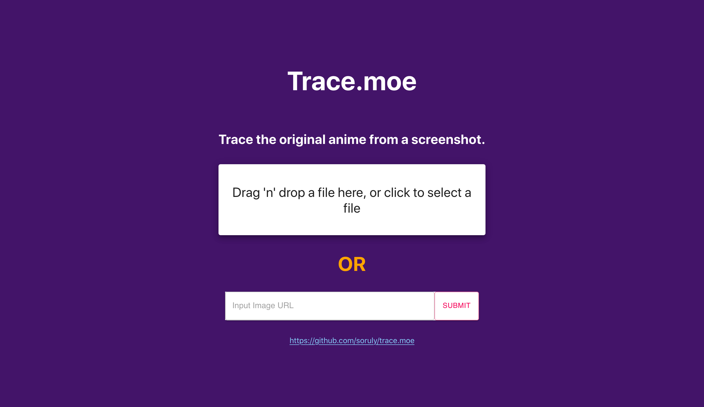

# trace-react

One day React project to use trace.moe for anime screenshot show matching. Does not require an API key.

Run `yarn start` to start the app in the development mode. 
Open [http://localhost:3000](http://localhost:3000) to view it in the browser.
